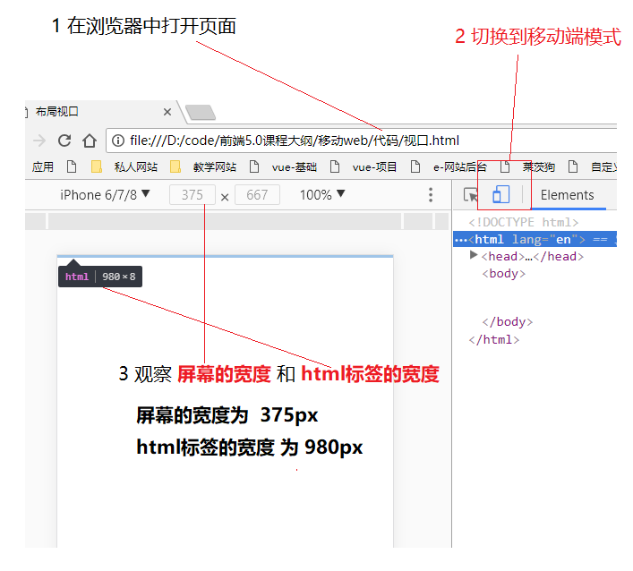
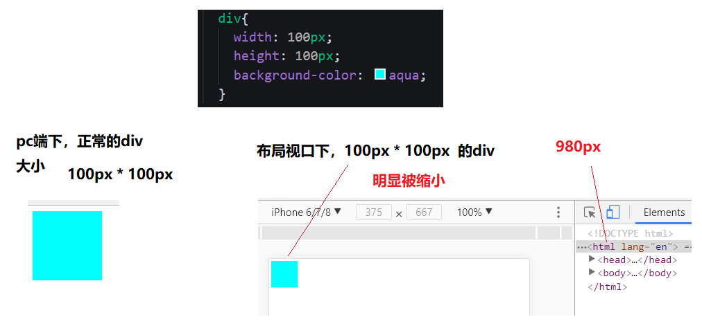
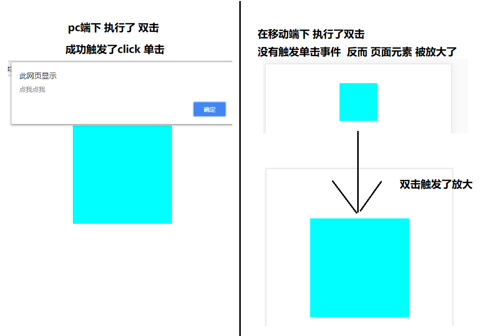

# theMobileWeb

# 1  移动web第一天

目录

## 1  学习目标

- 理解
  - 知道屏幕常见参数
  - 了解失真的原因以及解决办法
  - 了解视口、布局视口、理想视口的概念
- 应用
  - 手机京东--静态页面制作

## 5  视口

视口就是指我们在浏览器中看到的网页内容的区域


### 5.1  布局视口和理想视口

描述：

在移动端中，视口有两个，一个是布局视口另外一个是理想视口

- 布局视口，只需要了解写代码的时候不会使用
- 理想视口，需要学习了解，只要写移动web，一定要使用理想视口
- 两者的区别，只看有没有这一行代码

```html
<meta name="viewport" content="width=device-width, initial-scale=1.0">
```

- 没有，那就是布局视口
- 有，就是理想视口

### 5.2  布局视口（了解）

代码：没有添加`<meta name="viewport" content="width=device-width, initial-scale=1.0">`

```html
<!DOCTYPE html>
<html lang="en">
<head>
  <meta charset="UTF-8">
  <title>布局视口</title>
</head>
<body>
  
</body>
</html>
```



#### 5.2.1  结论

可以看到，在布局视口下，html标签的宽度变成了980px，而不是和屏幕等宽

- 980px 是手机厂商为了做兼容而设置的，因为以前的网站的版心宽度一般都是小于980px
- **把一个980px宽的页面放入到375px的小屏幕上，后果就是页面元素被缩小了（布局视口）**



以上结果，不是我们在移动端希望看到的，所以我们使用**理想视口**而不是**布局视口**

### 5.3  理想视口

只要在代码里面加入以下代码，就可以把布局视口变成了**理想视口**

` <meta name="viewport" content="width=device-width, initial-scale=1.0">`

完整代码

```html
<!DOCTYPE html>
<html lang="en">
<head>
  <meta charset="UTF-8">
  <title>理想视口</title>
  <meta name="viewport" content="width=device-width, initial-scale=1.0">
  <style>
    div{
      width: 100px;
      height: 100px;
      background-color: aqua;
    }
  </style>
</head>
<body>
  <div></div>
</body>
</html>
```


### 5.4  理想视口详细解释

标准的理想视口的代码的写法如下：

```html
<meta name="viewport" content="width=device-width, initial-scale=1.0,maximum-scale=1,minimum-scale=1,user-scalable=no">
```

在html页面中按入`meta:vp`+**tab** 即可快速敲入理想视口的代码   此为普通的理想视口的写法

`<meta name="viewport" content="width=device-width, initial-scale=1.0">`

相比普通的写法，标准的写法多了一些设置

- **后期会演示**（触屏事件中的clientX/Y和pageX/Y的演示）
- 使用**普通**的写法可能会出现一些莫名其妙的问题

**在写项目中建议使用标准的写法**

**参数的描述，了解即可**

- meta标签用来描述或设置一个HTML网页文档的属性
- content 要设置或者描述的内容
- width 设置视口的宽度 **device-width**等于屏幕的宽度
- initial-scale 页面打开的时候视口放大的倍数  **值:1**
- user-scalable 是否允许用户缩放页面 **值：no**
- maximum-scale 如果允许放大的话 最大放大多少倍 **值 ：1**
- minimum-scale  如果允许放大的话 最小放大多少倍 **值 ：1**


# 2  移动web第二天

- 理解京东头部的透明效果
  - 手机京东倒计时效果、
  - 真机调试的过程
  - 3个触屏事件
  - 3个触摸点数组
  - 3对坐标信息
- 应用
  - 封装移动端点击tap
  - 封装移动端滑动swipe

## 3  触屏事件

### 3.1  需求

1. 鼠标事件不能满足多指触控的需求
2. click点击事件在移动端存在延迟

### 3.2  click延迟解释

演示代码：

```html
<!DOCTYPE html>
<html lang="en">
<head>
  <meta charset="UTF-8">
  <title>延迟.html</title>
  <style>
    div:nth-child(1) {
      width: 200px;
      height: 200px;
      background-color: aqua;
      margin: 100px auto;
    }
  </style>
</head>
<body>
  <div></div>
  <script>
    var div = document.querySelector("div");
    div.addEventListener("click", function () {
      alert("点我点我");
    })
  </script>
</body>
</html>
```

在**pc端下双击**和在**移动端下双击**，div现象



**解释：**

在移动端上执行双击时

- 在第一次单击过后，浏览器等待了一小段时间
- 如果在短时间内
  - 有第二次的点击发生，触发双击放大
  - **没有第二次点击，触发的click点击事件**

也就是说，在第一次点击过后，不管有没有第二次的点击产生，都会先等待一小段时间。


**谁做的处理？**

这个机制，也是手机厂商为了方便用户放大页面做的处理。所带来的后果就是click有延迟，降低了用户体验。


**学习触屏事件的目的：**

因此，我们学习触屏事件就是为了解决click延迟，封装常见的手势事件。


### 3.3  概念

手指触摸到移动设备的时候所发生的一些事件


### 3.4  触屏事件类型

- **touchstart** 手指触碰到屏幕的时候触发，对比 mousedown
- touchmove 手指在屏幕上滑动的时候触发，对比**mousemove**
- **touchend** 手指离开屏幕的时候触发，对比mouseup

**注意：**

- 建议 **dom.addEventListener** 的方式绑定，不建议使用 **dom.ontouchstart** 的方式绑定(低版本不识别)

```js
div.addEventListener("touchstart", function () {
     
})
```

- 触屏事件只能在移动端上，在pc端上无法触发

### 3.5  三个触摸点对象数组

当多个手指触摸到屏幕上时，这些手指的坐标等相关信息，存放在三个不同的触摸点数组当中。

- **touches**屏幕上所有的触摸点的集合
- **targetTouches**目标元素上触摸点的集合
- **changedTouches**在目标元素上发生进入，离开和移动的触摸点的集合

#### 3.5.1  学习touches和targeTouches

给一个div绑定touchstart事件，事件中打印出这两个数组的长度

```html
 <style>
    div:nth-child(1) {
      width: 200px;
      height: 200px;
      background-color: aqua;
      margin: 100px auto;
    }
  </style>
</head>

<body>
  <div></div>
  <script>
    var div = document.querySelector("div");
    div.addEventListener("touchstart",function (e) {
      console.log("屏幕上:"+e.touches.length);
      console.log("目标元素上:"+e.targetTouches.length);
    })
  </script>
</body>
```


#### 3.5.2  学习targetTouches和changeTouches

给div绑定**touchend**事件，事件中分别打印**targetTouches**长度

```html
<style>
    div:nth-child(1) {
      width: 200px;
      height: 200px;
      background-color: aqua;
      margin: 100px auto;
    }
  </style>
</head>

<body>
  <div></div>
  <script>
    var div = document.querySelector("div");
    div.addEventListener("touchend",function (e) {
      console.log("目标元素上:"+e.targetTouches.length);
      console.log("屏幕上状态改变:"+e.changedTouches.length);
    })
  </script>
</body>
```


#### 3.5.3  小结

- 如果要获取离开屏幕的手指的信息，只能通过 **touchend** 事件中的 **changedTouches** 数组**（切记）**
- 由于 **changedTouches** 数组功能还不够完善，同时离开2个、3个手指时，它的长度都是1
- 当需要获取多个同时离开屏幕的手指信息时，可以同时结合3个触摸点数组来完成(了解-具体情况具体分析)

### 3.6  触摸点对象的3对位置属性

- clientX/clientY 相对于浏览器视口的坐标
- pageX/pageY 相对于页面的坐标
- screenX/screenY 相对于屏幕的坐标


### 3.7  手势封装

使用三个触屏事件**touchstart**,**touchmove**,**touchend**封装自己的手势事件


### 3.8  封装移动端点击事件tap


#### 3.8.1  分析：

- 判断按下的手指个数不超过1个
- 判断手指按下的时间不能太长 300ms
- 判断手指按下的时候，滑动的距离不能太长  (自定义<5px)

#### 3.8.2  用到哪些触屏事件

1. **touchstart,touchend**

2. **touchstart**

   **touches.length**

   记录按下的时间  startTime

   记录开始的坐标

3. **touchend**

   **changedTouches**

   如果要获取离开屏幕的手指的信息，只能通过 **touchend** 事件中的 **changedTouches** 数组**（切记）**

   记录松开的时间  endTime-startTime=

   记录松开手的坐标，结束的坐标-开始的坐标 = 

#### 3.8.3  示例代码

```js
<script>
  var div = document.querySelector("div");
  //开始按下的时间
  var startTime;
  //开始按下的坐标
  var startX, startY;
  //按下
  div.addEventListener("touchstart", function (e) {
    // 1、判断手指的个数
    if (e.touches.length > 1) {
      return;
    }
  //2、记录按下的时间
  startTime = Date.now();
  //3、获取开始的坐标
  startX = e.touches[0].clientX;
  startY = e.touches[0].clientY;
});
//离开
div.addEventListener("touchend", function (e) {
  //1、判断手指的个数(记住--这里判断的是changedTouches)
  if (e.changedTouches.length > 1) {
    return;
  }
  //2
  endTime = Date.now();
  //判断按下时长
  if (endTime - startTime > 300) {
    return;
  }
  //3、获取松开手的坐标
  var endX = e.changedTouches[0].clientX;
  var endY = e.changedTouches[0].clientY;
  //判断滑动的距离 5px
  if (Math.abs(endX - startX) > 5 || Math.abs(endY - startY) > 5) {
    return;
  }
  //通过验证，此时可以触发tap的点击的逻辑
  console.log("自己的tap");
});
</script>
```

### 3.9  封装移动端滑动事件swipe


#### 3.9.1  分析

1. 判断手指的个数，不能超过1个

2. 判断按下的事件，不能太长（自定义800ms）

3. 判断按下的距离，不能太短，大于（自定义5px）

   判断距离

   判断方向

#### 3.9.2  示例代码

```js
<script>
  var div = document.querySelector("div");
  //按下的时间
  var startTime;
  //按下的坐标
  var startX,startY;
  //按下
  div.addEventListener("touchstart",function (e) {
    //1 判断手指的个数
    if (e.touches.length > 1) {
      return;
    }
    //2、记录按下的时间
    startTime = Date.now();
    //3、记录按下的坐标
    startX = e.touches[0].clientX;
    startY = e.touches[0].clientY;
  });
//离开
div.addEventListener("touchend",function (e) {
  //1、判断手指的个数
  if (e.changedTouches.length > 1) {
    return;
  }
  //2、记录时间
  var endTime = Date.now();
  //
  if (endTime - startTime > 800) {
    return;
  }
  //4、记录离开的坐标
  var endX = e.changedTouches[0].clientX;
  var endY = e.changedTouches[0].clientY;
  //滑动的方向
  var direction;
  //先判断距离
  if (Math.abs(endX - startX)>5) {
    //在水平方向上发生了移动
    direction = endX>startX?"right":"left";
  } else if (Math.abs(endY-startY)>5) {
    //在垂直方向上发生移动
    direction = endY>startY?"down":"up";
  } else {
    //没有发生移动
    return;
  }
  //触发滑动的逻辑
  console.log(direction);
});
</script>
```

### 4  封装tap\swipe成插件


# 3  移动web第三天

## 1  学习目标

- 理解
  - 手机京东--轮播图原生js实现
  - zepto使用
  - zepto定制
  - 手机京东-zepto改造
  - swiper.js插件使用
  - 手机京东-swiper.js轮播图使用
- 应用
  - 京东分类页面--静态页面

