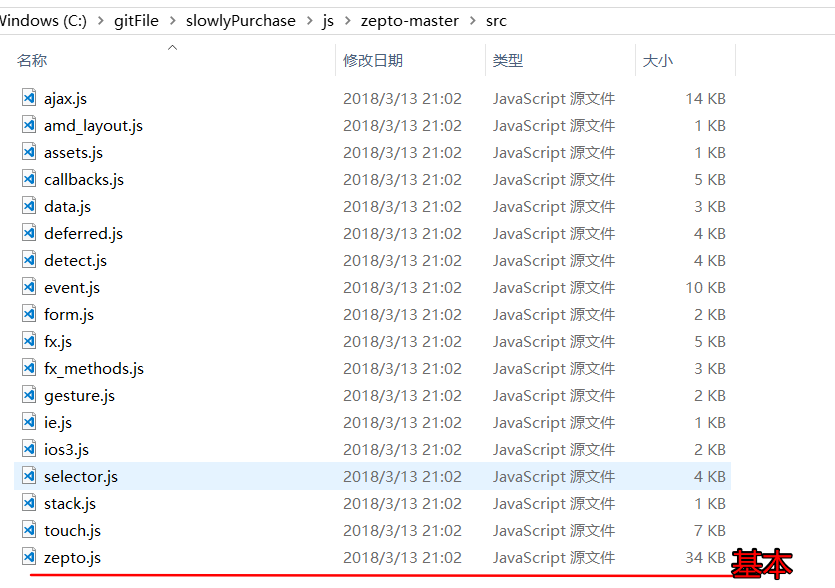
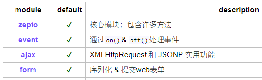

# theMobileWeb

目录

1  移动web第一天

[视口](#5--视口)

2  移动web第二天

[触屏事件](#3--触屏事件)

# 1 移动web第一天

## 1  学习目标

- 理解
  - 知道屏幕常见参数
  - 了解失真的原因以及解决办法
  - 了解视口、布局视口、理想视口的概念
- 应用
  - 手机京东--静态页面制作

## 5  视口

视口就是指我们在浏览器中看到的网页内容的区域


### 5.1  布局视口和理想视口

描述：

在移动端中，视口有两个，一个是布局视口另外一个是理想视口

- 布局视口，只需要了解写代码的时候不会使用
- 理想视口，需要学习了解，只要写移动web，一定要使用理想视口
- 两者的区别，只看有没有这一行代码

```html
<meta name="viewport" content="width=device-width, initial-scale=1.0">
```

- 没有，那就是布局视口
- 有，就是理想视口

### 5.2  布局视口（了解）

代码：没有添加`<meta name="viewport" content="width=device-width, initial-scale=1.0">`

```html
<!DOCTYPE html>
<html lang="en">
<head>
  <meta charset="UTF-8">
  <title>布局视口</title>
</head>
<body>
  
</body>
</html>
```


#### 5.2.1  结论

可以看到，在布局视口下，html标签的宽度变成了980px，而不是和屏幕等宽

- 980px 是手机厂商为了做兼容而设置的，因为以前的网站的版心宽度一般都是小于980px
- **把一个980px宽的页面放入到375px的小屏幕上，后果就是页面元素被缩小了（布局视口）**


以上结果，不是我们在移动端希望看到的，所以我们使用**理想视口**而不是**布局视口**

### 5.3  理想视口

只要在代码里面加入以下代码，就可以把布局视口变成了**理想视口**

` <meta name="viewport" content="width=device-width, initial-scale=1.0">`

完整代码

```html
<!DOCTYPE html>
<html lang="en">
<head>
  <meta charset="UTF-8">
  <title>理想视口</title>
  <meta name="viewport" content="width=device-width, initial-scale=1.0">
  <style>
    div{
      width: 100px;
      height: 100px;
      background-color: aqua;
    }
  </style>
</head>
<body>
  <div></div>
</body>
</html>
```


### 5.4  理想视口详细解释

标准的理想视口的代码的写法如下：

```html
<meta name="viewport" content="width=device-width, initial-scale=1.0,maximum-scale=1,minimum-scale=1,user-scalable=no">
```

在html页面中按入`meta:vp`+**tab** 即可快速敲入理想视口的代码   此为普通的理想视口的写法

`<meta name="viewport" content="width=device-width, initial-scale=1.0">`

相比普通的写法，标准的写法多了一些设置

- **后期会演示**（触屏事件中的clientX/Y和pageX/Y的演示）
- 使用**普通**的写法可能会出现一些莫名其妙的问题

**在写项目中建议使用标准的写法**

**参数的描述，了解即可**

- meta标签用来描述或设置一个HTML网页文档的属性
- content 要设置或者描述的内容
- width 设置视口的宽度 **device-width**等于屏幕的宽度
- initial-scale 页面打开的时候视口放大的倍数  **值:1**
- user-scalable 是否允许用户缩放页面 **值：no**
- maximum-scale 如果允许放大的话 最大放大多少倍 **值 ：1**
- minimum-scale  如果允许放大的话 最小放大多少倍 **值 ：1**


# 2  移动web第二天

- 理解京东头部的透明效果
  - 手机京东倒计时效果、
  - 真机调试的过程
  - 3个触屏事件
  - 3个触摸点数组
  - 3对坐标信息
- 应用
  - 封装移动端点击tap
  - 封装移动端滑动swipe

## 3  触屏事件

### 3.1  需求

1. 鼠标事件不能满足多指触控的需求
2. click点击事件在移动端存在延迟

### 3.2  click延迟解释

演示代码：

```html
<!DOCTYPE html>
<html lang="en">
<head>
  <meta charset="UTF-8">
  <title>延迟.html</title>
  <style>
    div:nth-child(1) {
      width: 200px;
      height: 200px;
      background-color: aqua;
      margin: 100px auto;
    }
  </style>
</head>
<body>
  <div></div>
  <script>
    var div = document.querySelector("div");
    div.addEventListener("click", function () {
      alert("点我点我");
    })
  </script>
</body>
</html>
```

在**pc端下双击**和在**移动端下双击**，div现象


**解释：**

在移动端上执行双击时

- 在第一次单击过后，浏览器等待了一小段时间
- 如果在短时间内
  - 有第二次的点击发生，触发双击放大
  - **没有第二次点击，触发的click点击事件**

也就是说，在第一次点击过后，不管有没有第二次的点击产生，都会先等待一小段时间。


**谁做的处理？**

这个机制，也是手机厂商为了方便用户放大页面做的处理。所带来的后果就是click有延迟，降低了用户体验。


**学习触屏事件的目的：**

因此，我们学习触屏事件就是为了解决click延迟，封装常见的手势事件。


### 3.3  概念

手指触摸到移动设备的时候所发生的一些事件


### 3.4  触屏事件类型

- **touchstart** 手指触碰到屏幕的时候触发，对比 mousedown
- touchmove 手指在屏幕上滑动的时候触发，对比**mousemove**
- **touchend** 手指离开屏幕的时候触发，对比mouseup

**注意：**

- 建议 **dom.addEventListener** 的方式绑定，不建议使用 **dom.ontouchstart** 的方式绑定(低版本不识别)

```js
div.addEventListener("touchstart", function () {
     
})
```

- 触屏事件只能在移动端上，在pc端上无法触发

### 3.5  三个触摸点对象数组

当多个手指触摸到屏幕上时，这些手指的坐标等相关信息，存放在三个不同的触摸点数组当中。

- **touches**屏幕上所有的触摸点的集合
- **targetTouches**目标元素上触摸点的集合
- **changedTouches**在目标元素上发生进入，离开和移动的触摸点的集合

#### 3.5.1  学习touches和targeTouches

给一个div绑定touchstart事件，事件中打印出这两个数组的长度

```html
 <style>
    div:nth-child(1) {
      width: 200px;
      height: 200px;
      background-color: aqua;
      margin: 100px auto;
    }
  </style>
</head>

<body>
  <div></div>
  <script>
    var div = document.querySelector("div");
    div.addEventListener("touchstart",function (e) {
      console.log("屏幕上:"+e.touches.length);
      console.log("目标元素上:"+e.targetTouches.length);
    })
  </script>
</body>
```


#### 3.5.2  学习targetTouches和changeTouches

给div绑定**touchend**事件，事件中分别打印**targetTouches**长度

```html
<style>
    div:nth-child(1) {
      width: 200px;
      height: 200px;
      background-color: aqua;
      margin: 100px auto;
    }
  </style>
</head>

<body>
  <div></div>
  <script>
    var div = document.querySelector("div");
    div.addEventListener("touchend",function (e) {
      console.log("目标元素上:"+e.targetTouches.length);
      console.log("屏幕上状态改变:"+e.changedTouches.length);
    })
  </script>
</body>
```


#### 3.5.3  小结

- 如果要获取离开屏幕的手指的信息，只能通过 **touchend** 事件中的 **changedTouches** 数组**（切记）**
- 由于 **changedTouches** 数组功能还不够完善，同时离开2个、3个手指时，它的长度都是1
- 当需要获取多个同时离开屏幕的手指信息时，可以同时结合3个触摸点数组来完成(了解-具体情况具体分析)

### 3.6  触摸点对象的3对位置属性

- clientX/clientY 相对于浏览器视口的坐标
- pageX/pageY 相对于页面的坐标
- screenX/screenY 相对于屏幕的坐标


### 3.7  手势封装

使用三个触屏事件**touchstart**,**touchmove**,**touchend**封装自己的手势事件


### 3.8  封装移动端点击事件tap


#### 3.8.1  分析：

- 判断按下的手指个数不超过1个
- 判断手指按下的时间不能太长 300ms
- 判断手指按下的时候，滑动的距离不能太长  (自定义<5px)

#### 3.8.2  用到哪些触屏事件

1. **touchstart,touchend**

2. **touchstart**

   **touches.length**

   记录按下的时间  startTime

   记录开始的坐标

3. **touchend**

   **changedTouches**

   如果要获取离开屏幕的手指的信息，只能通过 **touchend** 事件中的 **changedTouches** 数组**（切记）**

   记录松开的时间  endTime-startTime=

   记录松开手的坐标，结束的坐标-开始的坐标 = 

#### 3.8.3  示例代码

```js
<script>
  var div = document.querySelector("div");
  //开始按下的时间
  var startTime;
  //开始按下的坐标
  var startX, startY;
  //按下
  div.addEventListener("touchstart", function (e) {
    // 1、判断手指的个数
    if (e.touches.length > 1) {
      return;
    }
  //2、记录按下的时间
  startTime = Date.now();
  //3、获取开始的坐标
  startX = e.touches[0].clientX;
  startY = e.touches[0].clientY;
});
//离开
div.addEventListener("touchend", function (e) {
  //1、判断手指的个数(记住--这里判断的是changedTouches)
  if (e.changedTouches.length > 1) {
    return;
  }
  //2
  endTime = Date.now();
  //判断按下时长
  if (endTime - startTime > 300) {
    return;
  }
  //3、获取松开手的坐标
  var endX = e.changedTouches[0].clientX;
  var endY = e.changedTouches[0].clientY;
  //判断滑动的距离 5px
  if (Math.abs(endX - startX) > 5 || Math.abs(endY - startY) > 5) {
    return;
  }
  //通过验证，此时可以触发tap的点击的逻辑
  console.log("自己的tap");
});
</script>
```

### 3.9  封装移动端滑动事件swipe


#### 3.9.1  分析

1. 判断手指的个数，不能超过1个

2. 判断按下的事件，不能太长（自定义800ms）

3. 判断按下的距离，不能太短，大于（自定义5px）

   判断距离

   判断方向

#### 3.9.2  示例代码

```js
<script>
  var div = document.querySelector("div");
  //按下的时间
  var startTime;
  //按下的坐标
  var startX,startY;
  //按下
  div.addEventListener("touchstart",function (e) {
    //1 判断手指的个数
    if (e.touches.length > 1) {
      return;
    }
    //2、记录按下的时间
    startTime = Date.now();
    //3、记录按下的坐标
    startX = e.touches[0].clientX;
    startY = e.touches[0].clientY;
  });
//离开
div.addEventListener("touchend",function (e) {
  //1、判断手指的个数
  if (e.changedTouches.length > 1) {
    return;
  }
  //2、记录时间
  var endTime = Date.now();
  //
  if (endTime - startTime > 800) {
    return;
  }
  //4、记录离开的坐标
  var endX = e.changedTouches[0].clientX;
  var endY = e.changedTouches[0].clientY;
  //滑动的方向
  var direction;
  //先判断距离
  if (Math.abs(endX - startX)>5) {
    //在水平方向上发生了移动
    direction = endX>startX?"right":"left";
  } else if (Math.abs(endY-startY)>5) {
    //在垂直方向上发生移动
    direction = endY>startY?"down":"up";
  } else {
    //没有发生移动
    return;
  }
  //触发滑动的逻辑
  console.log(direction);
});
</script>
```

### 4  封装tap\swipe成插件


# 3  移动web第三天

## 1  学习目标

- 理解
  - 手机京东--轮播图原生js实现
  - zepto使用
  - zepto定制
  - 手机京东-zepto改造
  - swiper.js插件使用
  - 手机京东-swiper.js轮播图使用
- 应用
  - 京东分类页面--静态页面


## 2  zepto.js

### 2.1  描述

被称为移动端的**jquery**

### 2.2  在线地址

- [下载地址](https://github.com/madrobby/zepto)
- [中文API](http://www.css88.com/doc/zeptojs_api/)

### 2.3  体验

> 1.引入js文件



> 2.像jquery一样进行使用

```html
<!DOCTYPE html> <html lang="en"> <head> <meta charset="UTF-8"> <meta name="viewport" content="width=device-width, initial-scale=1.0,maximum-scale=1,minimum-scale=1,user-scalable=no"> <title>03-zepto.html</title> <style> div{ width: 200px; height: 200px; background-color: aqua; margin: 100px auto; } </style> </head>
<body>
  <div></div>
  <!-- 引入zepto.js -->
  <script src="./zepto.js"></script>
  <script>
    // 绑定点击事件
    $("div").click(function () {
      // 链式编程 显示又隐藏
      $("div").hide().show();
    });
  </script>
</body>

</html>
```

### 2.4  模块化

>  不同于jquery将所有的代码都放入一个js文件中，zepto按照不同的模块拆分成了不同的js文件



>  当你在使用zepto的时候，出现了如以下报错的代码，那是提示你记得引入对应的模块

**xxx Is not a function**


### 2.5  定制zepto（了解）

> 如果我们需要引入zepto的很多模块的话，都单独引入反而变得麻烦


> 所以，最好是把一些常用模块打包到一个单独的zepto.js文件中

其实github也有[定制](https://github.com/madrobby/zepto#building) 的介绍

#### 2.5.1  定制zepto的步骤

1. 下载nodejs   [下载地址](http://nodejs.cn/download/)

2.  安装nodejs   [安装说明](https://www.runoob.com/nodejs/nodejs-install-setup.html)

3.   github下载zepto项目

4.   在zepto文件中，打开命令行工具 （shift+鼠标右键）

5.    在命令行工具中输入  `npm install`  等待安装完成  

6.    打开目录下的`make`文件，找到第41行

7. ​    在命令中输入`npm run-script dist`开始定制

8. 找到根目录的`dist`文件夹，所生成的zepto.js就是我们自己定制的zepto

   

   ​


# 4  移动web第四天

## 4.1  学习目标

- 理解
  - iscroll.js插件
  - 响应式布局概念
  - 媒体查询
  - css框架 bootstrap
- 应用
  - 京东分类页面-js实现滚动条
  - 京东分页页面-iscroll.js实现滚动
  - bootstrap组件查文档使用

## 4.2  iscroll.js

[跳转到该部分笔记](https://github.com/Lakers-twenty-four/jingdong#2--iscrolljs)

## 4.3  响应式布局

使用一套代码，可以在不同的设备(主要指屏幕的宽度)之间显示，并且提供友好的用户体验。

如：三星中国这个网站，屏幕宽度不同的时候，会自动切换样式以适应不同的设备

**PC端**


**移动端**


### 4.3.1  核心原理

>  响应式布局核心的原理是使用了css3中的**媒体查询**

## 4.4  响应式布局

是一种css语法，可以根据设备的不同（主要是屏幕的宽度不同）,去加载对应的css代码

我们只需要理它的作用，而代码是不用去记的。拿来修改即可使用。

### 4.4.1  初体验

以下代码分别在宽度400px，600px，800px的屏幕下显示的是不同颜色！

1. 在css中写入媒体查询的代码`@media screen and (width:xxx)`除了xxx之外，其他都是关键字
2. 只有当屏幕的宽度满足**width:值**条件时，才会去加载里面的css代码

```css
<style>
/* 800px body->red */

@media screen and (width:800px) {
  body {
    background-color: red;
  }
}

/* 600px body->blue */

@media screen and (width:600px) {
  body {
    background-color: #0094FF;
  }
}
</style>
```


### 4.4.2  媒体类型（了解）

>  媒体类型可以理解为不同的设备i，如打印机，计算机的屏幕等。可以加载不同的媒体类型，一般时**screen**使用得最多

- all 匹配所有的媒体类型，默认值
- screen 匹配计算机显示器
- print 匹配打印机设备

```css
/* 匹配所有的媒体类型 */
@media all {
  body {
    background-color: red;
  }
}

/* 匹配屏幕 */
@media screen {
  body {
    background-color: red;
  }
}

/* 匹配打印机 */
@media print {
  body {
    background-color: red;
  }
}
```

### 4.4.3 媒体特性（了解）

> 可以根据屏幕的宽度，高度等参数进行查询。这些参数就叫做媒体特性。

- width-宽度
- min-width 最少宽度
- max-width 最大宽度
- height 高度
- min-height 最少高度
- max-height 最大高度
- aspect-ratio 视口的宽高比
- min-aspect-ratio 最少宽高比
- max-aspect-ratio 最大宽高比

```css
<style>
/* >=800px body=>#0094FF */
@media screen and (min-width:800px) {
  body {
    background-color: #0094FF;
  }
}

/* <800px body=>pink */
@media screen and (max-width:800px) {
  body {
    background-color: pink;
  }
}
</style>
```

### 4.4.4  媒体关键字（了解）

- not 取反
- only  实现更好的兼容
- and 连接
- or 或者

```css
 /* 取反 屏幕宽度不为800px的时候 被选中 */
@media not screen and (width:800px){
  body{
    background-color: red;
  }
}
/* only 更好的兼容 屏幕为800px的时候被选中 */
@media only screen and (width:800px){
  body{
    background-color: red;
  }
}

/* or 代码中体现为 逗号(,)  意思屏幕为800px或者600px的时候被选中 */
@media screen and (width:800px),screen and (width:600px) {
  body{
    background-color: green;
  }
}
```

### 4.4.5  媒体查询引入方式

- **style**标签里或者css文件中
- **style标签上**
- link标签上

```html
<!-- 在style标签里或者在css文件里写媒体查询  -->
<style>
  @media screen and (width:800px) {
    body {
      background-color: red;
    }
  }
</style>

<!-- 在style标签上通过属性的方式写媒体查询 -->
<style media="screen and (width:800px)">
  body {
    background-color: red;
  }
</style>

<!-- 在link标签写媒体查询 -->
<link rel="stylesheet" media="screen and (width:800px)"  href="./base.css">
```

## 4.5  响应式框架Bootstrap

**Bootstrap**是最受欢迎的HTML、CSS和JS框架，用于开发响应式布局、移动设备优先的WEB项目

### 4.5.1  在线地址

[在线中文官网](http://www.bootcss.com/)

[下载地址](http://v3.bootcss.com/getting-started/#download)


### 4.5.2  初学者模板

> 务必用最新的设计和开发标准武装你的页面。这意味着使用 HTML5 doctype 声明、添加一个 `viewport` 标签让页面正确支持响应式布局。将这些整合在一起后，你的页面应当像下面这样：

```html
<!doctype html>
<html lang="en">
  <head>
    <!-- Required meta tags -->
    <meta charset="utf-8">
    <meta name="viewport" content="width=device-width, initial-scale=1, shrink-to-fit=no">

    <!-- Bootstrap CSS -->
    <link rel="stylesheet" href="https://cdn.bootcss.com/bootstrap/4.0.0/css/bootstrap.min.css" integrity="sha384-Gn5384xqQ1aoWXA+058RXPxPg6fy4IWvTNh0E263XmFcJlSAwiGgFAW/dAiS6JXm" crossorigin="anonymous">

    <title>Hello, world!</title>
  </head>
  <body>
    <h1>Hello, world!</h1>

    <!-- Optional JavaScript -->
    <!-- jQuery first, then Popper.js, then Bootstrap JS -->
    <script src="https://cdn.bootcss.com/jquery/3.2.1/jquery.slim.min.js" integrity="sha384-KJ3o2DKtIkvYIK3UENzmM7KCkRr/rE9/Qpg6aAZGJwFDMVNA/GpGFF93hXpG5KkN" crossorigin="anonymous"></script>
    <script src="https://cdn.bootcss.com/popper.js/1.12.9/umd/popper.min.js" integrity="sha384-ApNbgh9B+Y1QKtv3Rn7W3mgPxhU9K/ScQsAP7hUibX39j7fakFPskvXusvfa0b4Q" crossorigin="anonymous"></script>
    <script src="https://cdn.bootcss.com/bootstrap/4.0.0/js/bootstrap.min.js" integrity="sha384-JZR6Spejh4U02d8jOt6vLEHfe/JQGiRRSQQxSfFWpi1MquVdAyjUar5+76PVCmYl" crossorigin="anonymous"></script>
  </body>
</html>
```

> 以上这些就是所有页面必须的。请访问 [布局](https://v4.bootcss.com/docs/4.0/layout/overview/) 或 [官方实例](https://v4.bootcss.com/docs/4.0/examples/) 以作参考，然后就可以开始布局你的网站内容和组件了。

### 4.5.3  栅格系统

>  栅格系统按照移动规则把div的纵向排列改为类似表格的排列形式。

[官网关于网格系统的解释](https://v4.bootcss.com/docs/4.0/layout/grid/)

#### 4.5.3.1  四种宽度不同的屏幕

- 极小屏幕 xs 小于等于768px 手机设备
- 小屏幕 sm 768px ~992px 平板电脑
- 中等(普通)屏幕 md 992px~1200px - 老旧的电脑显示器
- 大屏 lg 大于1200px 大的电脑显示器

#### 4.4.3.2  编写栅格系统的步骤

- 版心容器 .container或者 .container-fluid
- 行 .row
- 栅格代码   col-(屏幕种类)-份数  如  col-xs-11

```html
<!-- 1 写大容器 .container-fluid -->
<div class="container-fluid">
  <!-- 2 写行 .row -->
  <div class="row">
    <h1>col-xs-1 一列占一份 一共 12份</h1>
    <!-- 3 写栅格 -->
    <div class="col-xs-1">.col-xs-1</div>
    <div class="col-xs-1">.col-xs-1</div>
    <div class="col-xs-1">.col-xs-1</div>
    <div class="col-xs-1">.col-xs-1</div>
    <div class="col-xs-1">.col-xs-1</div>
    <div class="col-xs-1">.col-xs-1</div>
    <div class="col-xs-1">.col-xs-1</div>
    <div class="col-xs-1">.col-xs-1</div>
    <div class="col-xs-1">.col-xs-1</div>
    <div class="col-xs-1">.col-xs-1</div>
    <div class="col-xs-1">.col-xs-1</div>
    <div class="col-xs-1">.col-xs-1</div>
  </div>
</div>

<!-- jQuery (Bootstrap 的所有 JavaScript 插件都依赖 jQuery，所以必须放在前边) -->
<script src="https://cdn.bootcss.com/jquery/1.12.4/jquery.min.js"></script>
<!-- 加载 Bootstrap 的所有 JavaScript 插件。你也可以根据需要只加载单个插件。 -->
<script src="https://cdn.bootcss.com/bootstrap/3.3.7/js/bootstrap.min.js"></script>
```

**补充：**

- 容器提供了一种中心和水平填充站点内容的方法。使用`.container`了应答像素宽度或`.container-fluid`用于`width: 100%`在所有视窗和器件尺寸。

